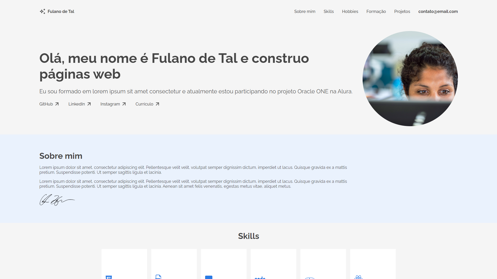
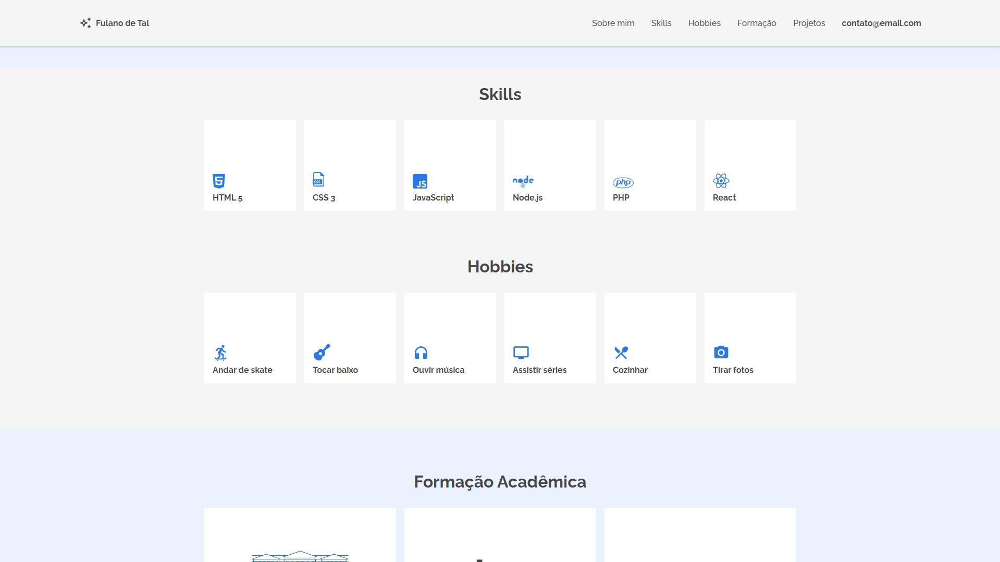
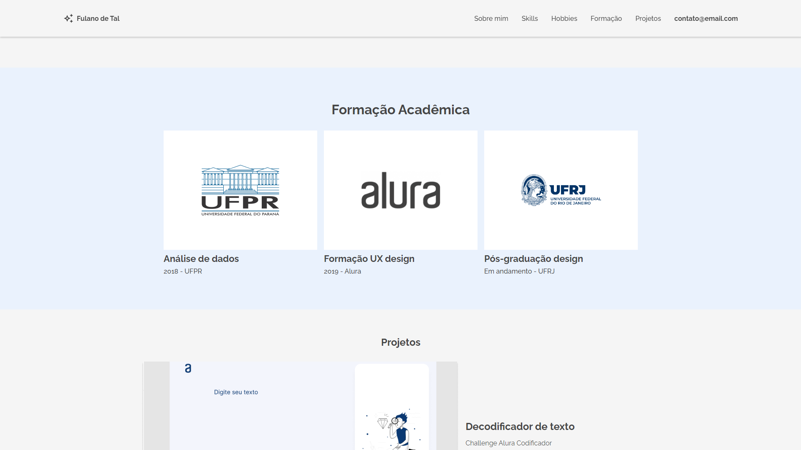
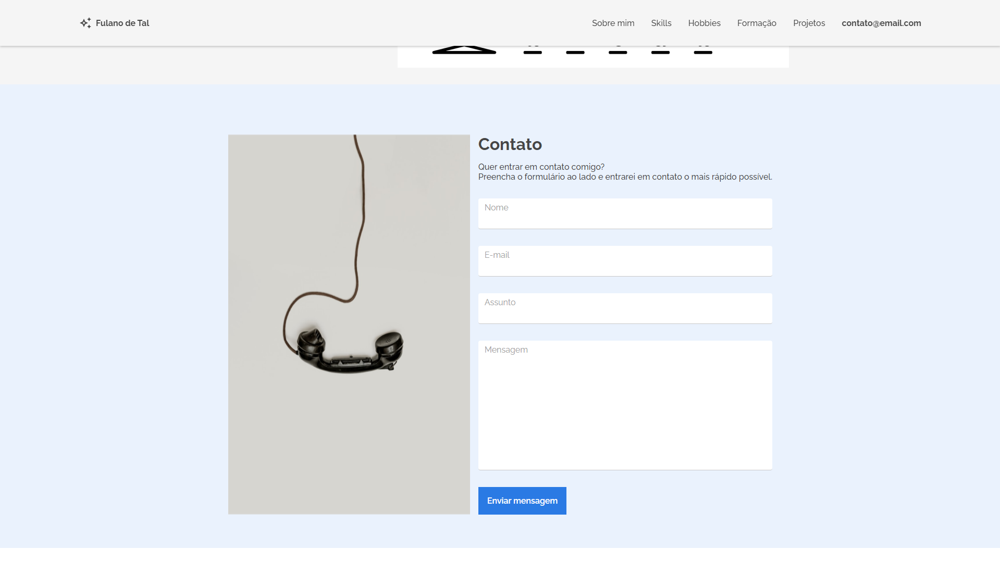

## Challenge Portfólio

<p align="center">
  
</p>

## Descrição

Desafio proposto pelo programa ONE é um projeto voltado para a criação de um portfólio. A aplicação foi desenvolvida em HTML e SCSS.

## Screenshots da Aplicação

<p align="center">
  
</p>
<p align="center">
  
</p>
<p align="center">
  
</p>
<p align="center">
  
</p>

### Requisitos

- Git
- Node.js
- Visual Studio Code

### Instalação

1. Clone o repositório:

   ```bash
   git clone https://github.com/kauatwn/portfolio-alura.git
   ```

2. Instale a dependência do SASS para utilizar o extensor do CSS:

   ```bash
   npm install
   ```

3. Instale a extensão **Live Sass Compiler** oferecida por Glenn Marks.

4. Instale a extensão **Live Server** oferecida por Ritwick Dey.

5. No Visual Studio Code, clique nos botões `Watch Sass` e `Go Live` no canto inferior direito.

### Explicações Adicionais

- **Watch Sass**: Compila automaticamente o SCSS e aplica as estilizações sempre que houver alterações nos arquivos SCSS.
- **Go Live**: Inicia um servidor local e abre a aplicação no navegador, permitindo ver as alterações em tempo real.
